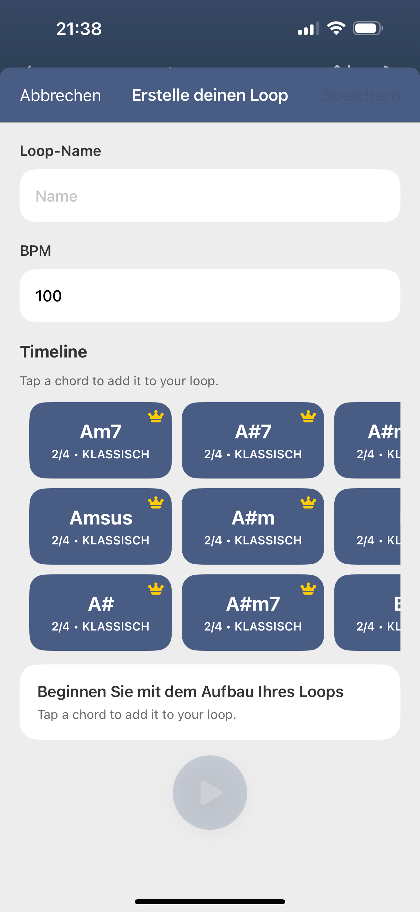
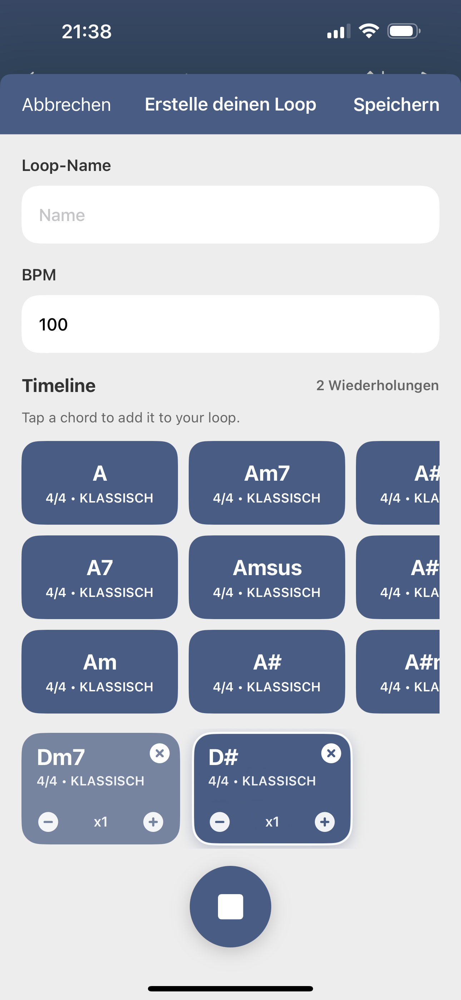
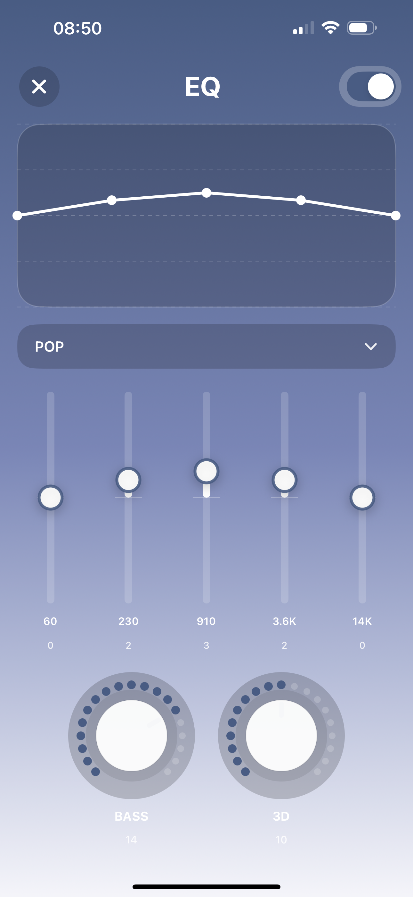

# ChordS for iOS

A music and rhythm companion for browsing, practicing, and playing chord- and loop-oriented content.

## About

ChordS for iOS focuses on building musical ideas one choice at a time. A chord or rhythm can become a repeatable loop, a saved practice session, or part of a larger playlist, with tempo, playback, and equalizer-oriented controls supporting the listening experience. The private project keeps this flow in shared SwiftUI views, view models, models, helpers, services, and audio-engine code.

## Screenshots

  
  
  

## Highlights

- Music and rhythm content browsing
- Loop playback with BPM and repeat controls
- Custom loops and playlist organization
- Saved tempo and practice-oriented playback state
- Equalizer-oriented listening controls
- Localized UI and App Store metadata
- Background playback and Live Activity support
- Firebase analytics, messaging, and in-app messaging
- Google Mobile Ads integration
- Xcode workspace/project and Fastlane metadata workflow

## Architecture

~~~mermaid
flowchart TD
    VIEW[SwiftUI views] --> VM[View models]
    VM --> MODEL[Music, loop, and playlist models]
    VM --> SERVICE[Shared application services]
    SERVICE --> ENGINE[Shared audio engine]
    ENGINE --> PLAYBACK[Playback, BPM, and repeat]
    VM --> EQ[Equalizer-oriented controls]
    APP[App state and Live Activity] --> SERVICE
    SERVICE --> FIREBASE[Firebase services]
    RELEASE[Fastlane metadata] --> ASC[App Store Connect]
~~~

The application separates SwiftUI presentation from view models, content models, and shared services. Playback-related state is coordinated by the service layer and passed to the shared audio engine, while app integrations and delivery automation stay outside the core content flow.

## Technology

| Area | Implementation |
| --- | --- |
| UI | SwiftUI |
| App structure | Shared views, view models, models, helpers, and services |
| Audio | Shared audio engine for music and loop playback |
| Playback features | BPM, repeat, background playback, Live Activity support |
| Platform services | Firebase Analytics, Firebase Messaging, Firebase In-App Messaging |
| Monetization | Google Mobile Ads SDK |
| Delivery | Xcode workspace/project and Fastlane |
| Targets | iOS 15+ target; macOS target also exists in the private workspace |
| Localization | Multiple localized resource bundles |

## Repository scope

Only showcase documentation and product screenshots are public here. No production Swift source, Firebase configuration, signing certificates, provisioning profiles, API keys, App Store Connect credentials, or private production media are included.
